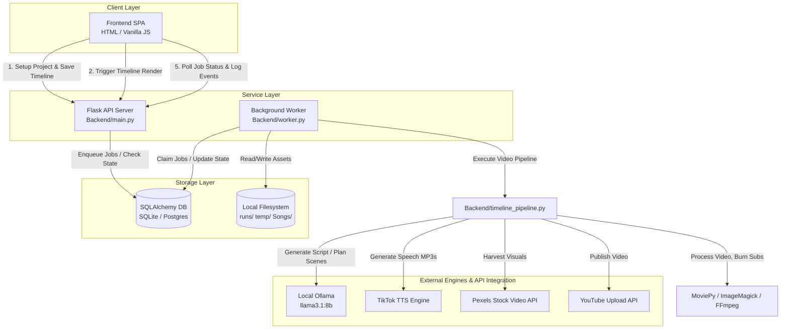

<p align="center">
  
</p>

<h1 align="center">UnknownScreen</h1>

<p align="center">
  <strong>An Ollama-First, Database-Backed Automated Shorts Generation Pipeline & Planner</strong>
</p>

<p align="center">
  <a href="https://trendshift.io/repositories/7545" target="_blank"></a>
</p>

<p align="center">
  <a href="https://github.com/FujiwaraChoki/UnknownScreen/stargazers"></a>
  <a href="https://github.com/FujiwaraChoki/UnknownScreen/blob/main/LICENSE"></a>
  <a href="https://dsc.gg/fuji-community"></a>
</p>

---

<p align="center">
  Sponsored by <a href="https://www.post-bridge.com/?ref=UnknownScreen"><strong>Post Bridge</strong></a>
  <br>
  <a href="https://www.post-bridge.com/?ref=UnknownScreen">
    
  </a>
</p>

---

> 𝕏 Follow the creator on X: [@DevBySami](https://x.com/DevBySami)  
> 🎥 Watch the video demo on [YouTube](https://youtu.be/mkZsaDA2JnA?si=pNne3MnluRVkWQbE)

UnknownScreen is an open-source, Ollama-first automated system designed to create, schedule, edit, and render engaging vertical video shorts (YouTube Shorts, TikTok, Instagram Reels) using local Large Language Models (LLMs) and advanced media processing pipelines.

---

## 📖 Table of Contents

- [⚡ Key Features](#-key-features)
- [🏗️ System Architecture](#️-system-architecture)
- [🚀 Quick Start](#-quick-start)
  - [Prerequisites](#prerequisites)
  - [Quick Installation](#quick-installation)
  - [Running Locally](#running-locally)
  - [Running with Docker](#running-with-docker)
- [⚙️ Configuration & Environment Variables](#️-configuration-&-environment-variables)
- [🔄 Project Planning & Timeline Render Workflow](#-project-planning-&-timeline-render-workflow)
- [🧪 Testing & Quality Assurance](#-testing-&-quality-assurance)
- [🛠️ Troubleshooting & FAQ](#️-troubleshooting-&-faq)
- [🤝 Contributing & Support](#-contributing-&-support)
- [📜 License](#-license)

---

## ⚡ Key Features

*   **Ollama-First & Cost-Effective**: Generates fully-customized scripts, scene metadata, and search queries locally using Ollama models (e.g., `llama3.1:8b`), eliminating dependency on expensive third-party LLM APIs.
*   **Structured Project Planning**: Shifts from one-shot generation to a non-linear workspace. Users choose from **10 repeatable format templates**, generate structured scene timelines, and refine voiceover texts, video queries, and durations before rendering.
*   **Database-Backed Queue Architecture**: Driven by a multi-process queue system (Flask API + SQLAlchemy Worker). Job states, progress events, and logs are persisted to SQLite or PostgreSQL, ensuring reliability, crash recovery, and runtime cancellation.
*   **High-Fidelity Media Synthesis**:
    *   **Text-to-Speech (TTS)**: Integration with TikTok's TTS engine supporting 60+ natural voices with threaded chunking.
    *   **Visual Harvesting**: Automatic search and download of context-relevant stock clips from the Pexels API.
    *   **Audio Compiling**: Custom background music overlay from a songs directory with configurable mixing levels.
    *   **Dynamic Subtitle Burning**: Automated subtitle generation (.srt) burned directly onto the video using MoviePy and ImageMagick.
*   **Auto-Publishing Integration**: Seamlessly exports and uploads finished vertical MP4 files directly to YouTube via Google OAuth2 APIs.

---

## 🏗️ System Architecture

UnknownScreen separates user-facing configurations, API endpoints, background worker logic, and data layers to achieve stability and scalability.



### Video Generation Lifecycle

When a project timeline is triggered for rendering:
1. **Queued**: The Flask API registers the job state and timeline snapshot in the database.
2. **Running**: The background worker claims the job, creates project-scoped directories under `runs/`, and initiates the render pipeline stage-by-stage.
3. **Stage Progression**:
   - **Validation**: Normalizes timeline scenes and checks durations.
   - **TTS Generation**: Compiles voiceovers for all scenes using threaded TikTok TTS chunks.
   - **Asset Harvesting**: Searches and downloads Pexels background videos matching search queries.
   - **Subtitles Compilation**: Resolves sentence-level word timings and creates SRT profiles.
   - **Video Rendering**: Cuts, crops (9:16 vertical ratio), and stitches stock clips, overlays background tracks, and burns subtitle frames.
   - **Report Writing**: Generates `render_report.json` with metadata, statistics, and warnings.
4. **Completion / Failure**: Saves final `output.mp4` to the run directory and updates job statuses.

---

## 🚀 Quick Start

### Prerequisites

Ensure you have the following system dependencies installed on your machine:

1.  **Python**: Version `>= 3.11` (managed via `uv` or `pip`).
2.  **FFmpeg**: Required for audio/video processing and encoding.
    *   *macOS*: `brew install ffmpeg`
    *   *Linux (Ubuntu)*: `sudo apt install ffmpeg`
3.  **ImageMagick**: Required by MoviePy to render and burn text subtitles.
    *   *macOS*: `brew install imagemagick`
    *   *Linux (Ubuntu)*: `sudo apt install imagemagick`
4.  **Ollama**: Installed and running locally.
    *   Download from [ollama.com](https://ollama.com).

---

### Quick Installation

Clone the repository and initialize the project dependencies using the automated setup script:

```bash
# Clone the repository
git clone https://github.com/FujiwaraChoki/UnknownScreen.git
cd UnknownScreen

# Run the interactive setup script
chmod +x setup.sh
./setup.sh
```

Alternatively, you can manually bootstrap the project using `uv`:

```bash
# Copy template configuration
cp .env.example .env

# Install dependencies into virtual environment
uv sync

# Fetch the default local LLM
ollama serve &
ollama pull llama3.1:8b
```

---

### Running Locally

To run the full stack locally, you need three separate terminals running the backend API, the background worker queue, and the frontend server:

#### Terminal 1: Backend Flask API
```bash
uv run python Backend/main.py
```
*API runs on: [http://localhost:8080](http://localhost:8080)*

#### Terminal 2: Queue Worker
```bash
uv run python Backend/worker.py
```
*Processes queued video renders and writes runtime assets.*

#### Terminal 3: Frontend Server
```bash
python3 -m http.server 3000 --directory Frontend
```
*Access the user interface at: [http://localhost:3000](http://localhost:3000)*

---

### Running with Docker

You can run the entire ecosystem (Frontend, Backend API, Worker, and a dedicated Postgres database) with a single Docker Compose command:

```bash
docker compose up --build
```

*   **Frontend Client**: [http://localhost:8001](http://localhost:8001)
*   **Backend API**: [http://localhost:8080](http://localhost:8080)
*   **Postgres Database**: `localhost:5432`

---

## ⚙️ Configuration & Environment Variables

Create a `.env` file in the root directory. Below are the primary environment variables:

| Variable | Description | Required | Default |
| :--- | :--- | :---: | :--- |
| `TIKTOK_SESSION_ID` | TikTok authentication cookie value needed to access the TTS API. | **Yes** | - |
| `PEXELS_API_KEY` | API Key for searching and downloading stock video clips. | **Yes** | - (Falls back to color clips) |
| `IMAGEMAGICK_BINARY`| Absolute path to the ImageMagick executable. Left empty for auto-detect. | No | *Auto-detected* |
| `DATABASE_URL` | SQLAlchemy-compatible database URI. | No | `sqlite:///UnknownScreen.db` |
| `OLLAMA_BASE_URL` | URL where the local Ollama instance is served. | No | `http://localhost:11434` |
| `OLLAMA_MODEL` | The default Ollama LLM to use for generation. | No | `llama3.1:8b` |
| `ASSEMBLY_AI_API_KEY`| API Key for subtitle audio transcription (if not using local timing).| No | - |

---

## 🔄 Project Planning & Timeline Render Workflow

UnknownScreen provides a streamlined, editable video planning system.

```
[ Enter Video Topic ] ──> [ Choose Format Template ] ──> [ Generate Scene Plan ]
                                                                   │
                                                                   ▼
[ Trigger Video Render ] <── [ Edit Scene Scripts, Queries & Order ] 💬
          │
          ▼
   [ Final Output ] 🎬 (Saved to runs/ directory)
```

1.  **Format Templates**: Choose from 10 specialized templates (e.g., *Deep Dilemmas*, *Quick Facts*, *Philosophical Quotes*, *Would You Rather*, *Storytelling*) which shape the Ollama generation instructions.
2.  **Interactive Scene Cards**: The generated timeline JSON is presented in the UI as scene cards. You can manually adjust the caption content, modify the visual keyword query for Pexels, adjust the scene durations, or reorder scenes.
3.  **Real-Render Generation**: Once you save the timeline and click render, the system initiates a render job. The worker processes the scene plan, generates custom audio segments, pulls corresponding stock clips, overlays them, formats subtitles, and combines the media into the final export file.

---

## 🧪 Testing & Quality Assurance

UnknownScreen is backed by a robust suite of unit and integration tests using `pytest` to ensure database models, API handlers, worker locks, and pipeline adapters function correctly.

Run the entire test suite using `uv`:

```bash
# Run all tests
uv run pytest

# Run with verbose output
uv run pytest -v

# Run specific test modules
uv run pytest tests/test_api_jobs.py
```

---

## 🛠️ Troubleshooting & FAQ

### ImageMagick is not detected or throws access errors
UnknownScreen attempts to auto-detect ImageMagick from your `PATH`. If auto-detection fails, configure the absolute path manually in your `.env`:
*   *Windows*: `IMAGEMAGICK_BINARY="C:\\Program Files\\ImageMagick-7.1.0-Q16\\magick.exe"` (ensure double backslashes are used).
*   *macOS/Linux*: Verify your security policy settings if you get authorization errors (e.g., edit `/etc/ImageMagick-7/policy.xml` to allow text/PDF read/writes).

### Pexels API limits or missing video clips
If you do not set a `PEXELS_API_KEY` or exceed API limits, the generation pipeline will automatically generate solid-colored clips as fallbacks instead of crashing, logging a warning to the render report.

### playsound installation wheels fail
If you encounter errors building the wheel for `playsound` during installation, run:
```bash
uv pip install -U wheel
uv pip install -U playsound
```

---


